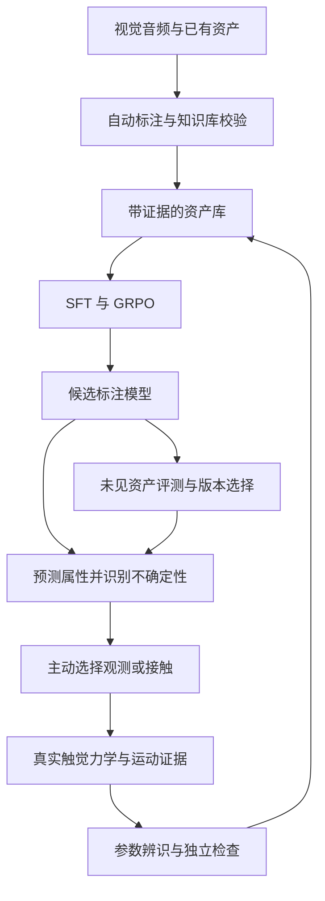

# Self-Evolving Physical VLM：自进化物理视觉语言模型

**Evidence-grounded Annotation, Active System Identification and Continual Learning**

本方案以 **OmniFysics-Nano-V2 Technical Report: Understanding the Physical World Across Modalities** 为明确基线，设计一套由 coding agent 组织的物理数据生产、模型训练和真实交互闭环。核心目标是同步形成两个成果：**带几何、物理属性和实验证据的资产库**，以及**能够自动标注物理属性、识别证据不足并根据接触反馈纠错的跨模态模型**。

建议将研究问题表述为：在有限真实交互预算下，能否通过主动获取视觉、声音、触觉和力学证据，持续提高新资产的标注准确度、参数可辨识性和仿真预测能力，并把这些改进迁移到未见物体上。

本文中的系统结构、奖励、数据规模和验收目标均为**拟议设计**，不是已经完成的训练或实验结果。检索截止日期为 2026 年 10 月 3 日。

## 一 继承基准论文并明确研究增量

基准论文采用静态属性与动态事件两类监督，经过 SFT 和分阶段 GRPO 改善多模态物理理解；第 4.2.3 节还描述了将初始属性送入可微物理引擎，根据真实与模拟运动差异修正参数的流程。[基准论文 §3–4](https://arxiv.org/html/2609.25738v1)

| 基准论文提供的方法 | 本方案拟增加的能力 |
| --- | --- |
| 大模型生成属性标签并参考原型库 | 为每个属性保存证据来源、条件和可追溯修订记录 |
| 静态属性和动态事件监督 | 增加同步触觉、力、动作及接触位置，学习交互前后的属性更新 |
| SFT 和分阶段 GRPO | 用独立测量和可重放物理检验评分，训练纠错、合理拒答和高层探测选择 |
| 感知与仿真参数校准 | 主动选择下一次观测或接触，管理多解性，并在新实验上验证 |
| 具身应用流程 | 让 coding agent 改进数据、工具和训练代码，按固定指标验证版本收益 |

应将创新集中在**证据驱动的标注更新、预算约束下的主动辨识，以及资产和模型共同改进**。触觉接入、主动探索和 coding agent 本身都有既有研究，不能单独作为“首次实现”的主张。

## 二 相关研究与本方案的关系

| 工作 | 已有贡献 | 本方案中的用途 |
| --- | --- | --- |
| [OmniFysics-Nano-V2](https://arxiv.org/abs/2609.25738) | 物理监督与多模态训练主线 | 明确的方法基线 |
| [Octopi](https://arxiv.org/abs/2405.02794) | 将触觉视频接入语言模型，学习物体属性及推理 | 触觉输入和属性解释的基线 |
| [AnyTouch 2](https://arxiv.org/abs/2602.09617) | 跨光学触觉传感器的时序表征与力相关学习 | 触觉编码器候选及动态接触特征 |
| [Sparsh](https://arxiv.org/abs/2410.24090) | 自监督触觉表征 | 较简单的触觉编码器对照 |
| [MultiPLY](https://arxiv.org/abs/2401.08577) | 在三维环境中交替生成动作和接收多感官状态 | 高层探测动作与状态组织参考 |
| [ObjectFolder Benchmark](https://arxiv.org/abs/2306.00956) | 真实和合成物体的视听触数据及评测 | 多感官资产组织与预训练数据参考 |
| [Scalable Real2Sim](https://arxiv.org/abs/2503.00370) | 机器人交互、几何重建与惯性参数辨识 | 质量、质心、惯量测量技能 |
| [TwinAligner](https://arxiv.org/abs/2512.19390) | 视觉和动力学对齐 | 将标定、执行器误差与物体参数误差分开处理 |
| [PhysTwin](https://arxiv.org/abs/2503.17973) | 根据交互视频重建和拟合可变形物体 | 后续软体资产分支 |
| [LLMPhy](https://proceedings.mlr.press/v300/cherian26a.html) | 程序化参数提议与仿真误差反馈 | coding agent 调用辨识工具的对照 |
| [ENPIRE](https://arxiv.org/abs/2606.19980) | coding agent 组织重复真实实验与策略改进 | 复位、执行、验证、记录、改进的工程组织 |
| [Fysiverse-3D-SimReady](https://arxiv.org/abs/2609.31715) | 场景对齐、支撑接触修正与可运行仿真 | 几何和碰撞有效性检查 |

上述“用途”是本方案的接入选择，不表示这些工作已经实现本方案。特别是 MultiPLY 的感官交互数据含仿真生成部分，不能直接作为真实传感器参数真值；AnyTouch 2 的编码器迁移到新指尖后仍需校准。[MultiPLY 数据构建](https://arxiv.org/html/2401.08577v1) · [AnyTouch 2 方法与局限](https://arxiv.org/html/2602.09617v1)

## 三 系统闭环与三种独立更新



**快速更新资产。** 在单个 episode 内保持模型权重固定，根据新观测更新该物体属性的分布、接触关系和证据记录。

**批量更新模型。** 每轮汇总通过质量检查的证据，构建新的训练快照，执行 SFT 和 GRPO，再验证其在未见物体上的收益。没有新权重和独立泛化收益时，只能称为资产校准或检索增强。

**更新研究程序。** coding agent 提出改动、修改代码、运行实验和分析失败；改动可能涉及标注模板、同步检查、触觉适配器、数据采样、优化策略或探测动作选择。实验验证器、最终测试集和硬件执行边界由独立运行服务维护。

## 四 两个主要交付物

### 物理资产库

每件资产以真实物体实例为中心，同时记录区域、材料、状态和交互关系。最终资产包包括：

- 可编辑外观网格、碰撞几何、尺度、坐标系、关节或形变模型。

- 区域材料、物理属性分布、适用条件、参数来源和版本。

- 原始 RGB 或 RGB-D、音频、触觉序列、力矩、机器人状态及时间同步记录。

- 每次探测的动作、接触位置、输入力度、观测结果、有效性和失败原因。

- 自动标注、测量修正、参数辨识与独立验证的记录。

- 可按仿真后端导出的配置；刚体可使用 MJCF 或 URDF 加碰撞资产，软体保留原生求解器模型，避免强制塞进同一种格式。

建议提供按类别、材料、几何、接触面、证据类型和参数范围查询的接口。没有经过真实校验的资产可以保存，但不能标记为已验证资产。

### 新资产的几何构建

已有网格先统一尺度、坐标和对象身份；没有网格时，采集经标定的多视角 RGB-D 或图像，完成目标分割和对象级重建。外观网格与碰撞代理分别保存，检查轮廓、接触位置、支撑及静置行为。中空容器应保留内腔，软体保留适用的壳或体表示，不能为了碰撞方便将所有对象实体化。

将触觉接触点通过机器人和传感器外参绑定到资产表面。第一版可用多视角图像、区域掩码和几何测量摘要为 VLM 提供几何信息，无需同时研发新的点云主干。几何误差与材料参数误差分开检查后，再导出仿真资产。

### 标注 VLM

交付一组有共同版本来源的模型能力：

- **观察标注模式**：输入图像、视频和可选音频，输出区域、材料候选、参数先验、证据位置和不确定项。

- **交互修正模式**：进一步接收触觉、力和动作记录，输出修正后的属性及导致修正的证据。

- **主动感知模式**：提出下一项高层测量或接触技能及其目的，并在信息不足时明确保留未知项。

严格来说，带触觉和力输入的模型是对 VLM 的多感官扩展。保留视觉入口是为了支持资产批量初标；不应要求只有视觉时也能确定无法由外观辨识的隐藏属性。

## 五 资产属性和证据的统一表示

应区分四类量：物体属性、物体状态、接触关系和测量条件。质量属于实例；装有液体的容器应记录当前填充状态及总质量。摩擦属于两个表面的接触关系，需要关联表面材质、法向载荷、速度和环境。有效压缩刚度依赖几何及加载方向，不能直接等同于材料杨氏模量。传感器标定和相机位姿属于测量条件。

| 字段组 | 必须记录的内容 |
| --- | --- |
| 对象与区域 | 物体实例、几何版本、表面区域和材料候选 |
| 属性声明 | 名称、单位、数值或分布、未知或不适用状态 |
| 适用条件 | 接触对象、加载方向、速度范围、温湿度等相关条件 |
| 证据 | 原始数据引用、动作、时段、标定版本和估计方法 |
| 不确定性 | 区间或分布、估计方法、校准误差和可辨识性 |
| 版本来源 | 标注模型、知识库、代码、数据快照和验证器版本 |

拟采用四种证据标记：visual_prior、kb_checked、interaction_inferred、independent_validated。标记作用于**每个属性**，不会因为质量测准了就自动提升摩擦或刚度的可信度。直接测量与模型辨识分别记录，均保留仪器误差和适用条件。

每次修正新增一条声明并保留旧值。证据关系为“属性声明—观测—动作—标定—估计方法—验证结果”，便于追溯错误标签进入了哪一版模型。

以下仅为结构示例，不代表已测得的资产：

```json
{
  "asset_id": "example_object_001",
  "geometry_version": "v1",
  "property": "kinetic_friction",
  "contact_pair": ["object_base", "reference_plate"],
  "value": null,
  "unit": "dimensionless",
  "interval": null,
  "status": "unknown",
  "evidence_type": "visual_prior",
  "conditions": {
    "normal_load_N": null,
    "sliding_speed_m_per_s": null
  },
  "evidence_refs": [],
  "calibration_version": null,
  "estimator_version": null,
  "independent_validation": null
}
```

## 六 自动标注与物理知识库校验

### 自动标注链路

拟采用“目标定位—区域与材料候选—属性提议—知识校验—证据整理—训练样本”的顺序。教师模型可以是可调用的强多模态模型；coding agent 负责组织批处理、修改提示模板、检查失败和维护数据版本。教师模型权重不要求由本项目训练。

标注时同时输出：可直接观察到的现象、根据现象作出的推断、仍需测量的属性。动态事件先记录可见运动、声音和接触时刻，再生成物理解读，避免把解释写成已经测量的事实。

### 知识库的两类约束

**硬约束**处理单位、字段、适用性和明确物理关系。例如质量不能为负，密度和体积定义一致时才使用质量关系；仅在模型假设成立时检查相应公式。

**软先验**来自材料手册、产品规格或已验证资产的分布。外观相似的物体可能内部填充不同，超出先验范围应触发“新材料、空心结构、混合材料或标注错误”的检查，不能机械截断到范围内。

建议将知识库拆为物体原型、材料属性、接触关系、测量方法和适用条件五部分。初版可自建约 200–500 条有来源的原型记录，这只是项目规划规模。原论文完整原型库和训练数据在本次调研中未确认可直接复用，不能将自建库称为其原始数据。

### 标签进入训练集的条件

- 弱标签可以帮助初始对齐，但需要降权并显式保留证据类型。

- 真实实验产生的标签必须通过同步、标定、单位和重复性检查。

- 知识库一致性用于排除明显错误，不能独立充当数值真值。

- 失败操作只要传感有效且物理模型适用，仍可产生有价值的辨识数据；采集失败与任务失败分别处理。

- 使用独立抽样复核测量自动标签的错误率，并由此选择数据权重。

## 七 用真实接触建立可辨识的物理标签

建议首先构建桌面采集站：RGB-D 或多视角相机、一个光学触觉指尖、可标定的力矩测量来源、机器人状态记录，以及可选麦克风。质量参考可来自电子秤；软体实验需要可测量的位移或压入深度。具体型号取决于已有硬件。

必须先记录相机和指尖坐标变换、时间同步误差、传感器零点、触觉凝胶背景及力测量标定。光学触觉图像本身不是绝对力值；更换凝胶或指尖后需要检查原标定是否仍然适用。

| 目标属性 | 建议的探测技能 | 需要的证据及限制 |
| --- | --- | --- |
| 质量 | 称重或准静态托举 | 扣除工具重力和偏置；仅有局部触觉图像不足以唯一确定质量 |
| 质心和惯量 | 多姿态托举或受控激励 | 使用力矩和运动状态；先标定机器人及工具，检查激励是否充分 |
| 静摩擦 | 渐增切向力直到滑移 | 同时记录法向力、切向力和滑移事件，绑定接触表面对 |
| 动摩擦 | 受控载荷和速度下滑动 | 拟合摩擦模型并记录速度依赖；自由滑行通常不能同时唯一辨识质量 |
| 有效刚度 | 多深度压入与卸载 | 用力与位移曲线估计，扣除工具和凝胶顺应性 |
| 杨氏模量 | 已知几何下的专用压入或拉压 | 需要接触模型、几何和边界条件；不可直接把力位移斜率当模量 |
| 阻尼和黏弹性 | 多速度加载、保持、释放 | 比较迟滞、松弛或回弹；单个静态压入样本不足 |
| 恢复系数 | 可测速度的低能碰撞 | 记录碰撞前后法向速度和接触表面，控制姿态 |
| 表面纹理与滑移 | 轻扫与重复接触 | 支持局部纹理和滑移标签；材料化学成分仍可能不确定 |

每个技能输出原始观测、估计值或参数分布、拟合残差、适用假设和拒绝原因。存在多组等价参数时，保留候选集，并指定能消除歧义的下一项测量。

这种探测技能化思路参考 Scalable Real2Sim 的主动激励与惯性辨识，并借鉴 TwinAligner 先处理标定和执行器再匹配物体运动的安排。[Scalable Real2Sim](https://arxiv.org/html/2503.00370v1) · [TwinAligner](https://arxiv.org/html/2512.19390v1)

## 八 主动感知如何决定下一步

主动感知同时包括移动相机、切换视角、观察底部或接口，以及轻触、压入、滑动、托举和敲击。先选择足以降低歧义且成本较低的动作；只有视觉或声音无法解决的问题才需要更强的接触。

建议维护属性的候选分布和一个可执行的动作集合。候选动作由 VLM 提出，执行位置和参数由技能规划器确定。动作价值由经过校准的观测模型、参数敏感性和已有实验数据估计，不能直接等同于 VLM 的文字自信程度。

```text
动作效用 =
预期属性信息增益
+ 对当前任务重要属性的辨识收益
- 机器人时间与采集成本
- 重复采样成本

在满足已配置的可执行约束下，选择效用最高的动作。
```

在尚无可靠概率模型时，先用“候选参数在某动作下的模拟结果分歧”作为信息增益的代理，并与真实接触后的收益对照校准。模拟分歧大不一定意味着真实收益大，必须保留这个预测误差。

动作结束后，用真实数据更新属性分布，检查区间覆盖率、预测残差和新证据一致性。达到项目预设精度、预算耗尽或属性仍不可辨识时停止，并记录停止原因。

拟增加两层选择：**选哪个资产补证据**，以及**对该资产执行哪个动作**。前者结合模型分歧、知识库冲突、类别覆盖和预期训练收益；后者聚焦具体参数辨识。成本节省必须在同等精度下与随机选物、随机触碰和固定动作序列比较。

主动感知有既有工作，本项目应突出“减少标注错误并形成可复用训练证据”的目标，而不是仅证明 Agent 能主动触碰物体。[MultiPLY](https://arxiv.org/abs/2401.08577)

## 九 跨模态标注模型结构

建议采用一个支持图像、视频和文本的可训练主干，保留音频接口，并增加两个适配分支：

- **触觉分支**：光学触觉帧、背景帧、时间戳和传感器类型，经过 AnyTouch 2 或 Sparsh 等编码器产生时序 token，再投影到主干空间。

- **力和动作分支**：力矩、指尖位姿、机器人状态、接触位置及动作阶段，经独立时序编码器输入。编码前固定单位和坐标系。

- **对象及区域绑定**：每段触觉对应哪个物体、哪个表面区域、哪个时刻，必须显式关联，避免把局部软垫的属性扩散到整个复合物体。

基于触觉时序接入语言推理的选择参考 Octopi；动态触觉和力相关表征参考 AnyTouch 2。两者提供方法依据，不保证换传感器后无需适配。[Octopi](https://arxiv.org/abs/2405.02794) · [AnyTouch 2](https://arxiv.org/abs/2602.09617)

第一版让模型输出结构化字段：观察事实、材料候选、属性分布、单位、适用条件、证据引用、需要补测的项目，以及下一项高层技能。标量奖励从这些字段解析。若增加连续回归头，则用明确的监督损失训练，不能假设文本 GRPO 自动优化所有新增头。

训练时使用模态缺失标记和模态随机丢弃，让模型区分“没有触觉证据”和“触觉表明没有接触”。单独评估 RGB、RGB 加音频、RGB 加触觉，以及完整输入四种条件。

**交互后已知的隐藏信息不能泄露到交互前输入。** 同一物体形成两类样本：观测前的合理先验及探测请求；观测后的参数估计及证据解释。外观完全相同而内部质量不同的物体，视觉模式应保留分布或请求测量，不能被训练成凭图片背出确定质量。

## 十 SFT 与 GRPO 的实施顺序

### 第一阶段 构建可检验的训练起点

自动标注与知识库校验生成大规模弱监督数据，同时用少量标定好的参考物体建立可靠样本。公开触觉数据用于表征学习，不默认其具有本项目所有物理参数的真值。

拟组织六种 SFT 样本：区域和材料识别；物理属性及区间标注；接触和事件定位；相同动作下的结果预测；交互前后纠错；请求测量或说明不可辨识原因。弱标签、实测标签、辨识标签和合成标签分别采样并保留来源。

先训练触觉和力的投影接口，再做主干参数高效适配；是否进一步解冻主干，由开发集上的跨模态收益和遗忘程度决定。训练目标包括结构化回答、属性预测、证据定位和必要的跨模态对齐。每个损失都需要对应真实可获得的监督字段。

### 第二阶段 使用可验证奖励做 GRPO

GRPO 优化对象首先是 VLM 的回答和属性判断；高层探测选择在证据充分后单独训练。低层机器人控制由已验证技能执行，不与第一阶段的语言模型优化混成一个问题。

对同一观测输入采样一组候选回答，使用独立标签和固定验证器评分。数值参考来自称重、标定力位移曲线、受控辨识或有效的仿真真值；仿真来源必须与真实来源分别报告。

| 奖励项 | 建议的评分依据 | 防止出现的问题 |
| --- | --- | --- |
| 属性准确度 | 测量误差模型归一化后的数值误差或分布评分 | 把落入宽泛材料范围当作准确 |
| 接触与事件理解 | 传感器和时间标注支持的接触、滑移、加载阶段 | 根据物体语义猜接触事件 |
| 物理预测 | 固定真实动作下的运动、力或形变预测误差 | 只输出听起来合理的解释 |
| 不确定性 | 合适的概率评分或兼顾区间宽度与漏覆盖惩罚的区间评分 | 无限放宽区间或始终拒答 |
| 证据对应 | 引用的区域和时段是否确实包含证据 | 生成不存在的测量记录 |
| 格式和单位 | 模式校验与单位检查 | 靠正确 JSON 获得主要奖励 |

可以在开发集试验初始权重，例如属性 0.35、接触事件 0.20、物理预测 0.20、不确定性 0.15、证据对应 0.08、格式 0.02。它们只是候选起点，应根据奖励尺度校准后冻结。缺失监督的项按预设任务规则处理，不能由模型自行选择最容易的项。违反必需字段或数值有效性约束的回答不进入有效正奖励。

沿用奖励多样性筛选思想，但将全错样本放入困难样本队列，用补采或 SFT 处理；全对样本用于回放和覆盖维护。这样能减少无效 GRPO 更新，同时避免不断丢弃模型尚未掌握的属性。

### 第三阶段 为高层探测选择建立真实奖励

探测奖励应衡量一次动作带来的独立预测改善、可辨识性提升和成本。模型自己报告“更确定了”不能单独作为奖励。

只有在多个候选动作拥有可比较的真实结果、或经过验证的动作覆盖数据时，才进行相应的探测 GRPO。未执行且没有覆盖的动作不能用编造触觉结果评分；可先采用规则规划或 SFT。利用仿真预训练探测选择时，需通过真实预算匹配实验验证迁移。

### 第四阶段 将真实证据回流训练

每轮真实探索后先更新资产后验，再生成新数据快照。对新增可靠数据与历史回放数据重新执行 SFT 和 GRPO，形成候选模型。每次更新后评估新类别收益、旧类别遗忘、传感器迁移和不确定性校准，达标后才成为下一轮标注模型。

可微求解器更新的是资产物理参数；SFT 和 GRPO 更新的是模型权重。第一版可将前者估计结果转成后者监督，无需声称梯度能直接穿过模型生成的字符串。

## 十一 Coding agent 的工作机制

沿用前文设想，将 GPT-6 放在外层 coding agent 位置；实际被训练的是选定的可训练多模态模型。两者的职责和权重版本分开管理，外层模型服务也可以替换。

coding agent 是研究流程的控制器。它读取资产错误、交互记录和训练指标，提出可检验的假设，修改相关程序，再通过实验判断是否保留改动。可以先由一个 coding agent 配合独立验证服务实现；多角色是逻辑分工，不要求同时运行很多大模型。

| 逻辑角色 | 可修改或执行的内容 | 交付物 |
| --- | --- | --- |
| 数据工程 | 标注模板、解析器、同步检查、弱标签过滤 | 数据版本与错误分析 |
| 感知训练 | 触觉适配器、输入组织、SFT 与 GRPO 配置 | 模型候选与训练记录 |
| 实验规划 | 资产选择、候选探测技能、采样顺序 | 有预算的实验计划 |
| 物理辨识 | 参数化模型、估计器、残差诊断 | 参数后验与适用范围 |
| 独立评测 | 使用固定协议评估候选版本 | 是否提升、退化及成本报告 |

参考 ENPIRE 的可重复实验组织，将改进目标从操作策略扩展到数据和标注模型。[ENPIRE 官方代码](https://github.com/NVlabs/ENPIRE)

建议暴露以下结构化工具：查询资产、生成标注、检查属性、提出探测、执行已注册技能、同步观测、拟合物理参数、构建训练快照、启动 SFT、启动 GRPO、运行开发集评估、注册版本。每个调用返回输入版本、数据引用、质量状态、误差和成本。

coding agent 不直接写实时关节扭矩循环。真实执行器只接受已注册技能及范围内参数，并具有独立的接触力、速度、工作空间和复位检查。新技能先完成离线及受限验证后注册；正常实验无需每一步人工决定。

```text
对每个研究轮次：
  读取失败样本和独立开发集报告
  选择一个可检验假设并声明预算
  修改数据、模型或探测代码中的一类变量
  运行协议检查与小规模试验
  采集所需真实证据并验证数据质量
  生成不可变的训练快照
  运行候选 SFT 和 GRPO
  使用固定开发协议比较候选与当前版本
  保留有收益的改动，记录失败改动
  达到预算或停止条件后冻结版本
```

评分器、数据划分和测量标定不能在同一轮中被改成有利于候选模型的答案。如果确认验证器有错误，应单独修复并重跑受影响的基线，保留变更历史。最终隐藏测试不向调参循环反馈逐样本结果。

## 十二 自进化的防失真机制

**先验与真值隔离。** 教师模型给出的数值不得经知识库检查后自动升级为实测标签。下一轮模型训练保留真实证据占比及每种来源的误差统计，防止低成本伪标签淹没测量数据。

**参数误差与模型误差分离。** 若所有候选参数都解释不了力或形变曲线，应考虑几何、接触模型、边界条件、时间同步或传感器漂移。优先诊断这些原因，避免通过异常摩擦或刚度补偿。

**保留可辨识性边界。** 对无法区分的参数组合输出分布或候选集；如果没有稳定的单参数真值，评估其对新交互的预测能力及区间覆盖，不伪造唯一标签。

**按物体划分数据。** 同一实例、多视角、接触片段、近重复网格、产品变体与相同原始视频放入同一数据组。训练时可以检索训练资产库；隐藏测试资产的已测答案不能通过检索进入模型。另报告“已知资产检索”和“未见资产泛化”两种任务。

**按传感器条件记录分布变化。** 更换指尖、凝胶、测量范围或工具后，先验证标定和已知参考物体。不能将传感器漂移误写成物体参数变化。

**同时报告绝对性能与成本。** 每轮报告机器人时间、测量次数、人工干预、GPU 时间和模型调用成本；候选性能提升不能完全来自更多真实接触或更大训练预算。

## 十三 建议形成的三个研究贡献

以下是需要通过实验检验的贡献候选，尚不能据此宣称新颖性已经成立或优于已有方法。

| 拟议贡献 | 具体技术内容 | 需要证明什么 |
| --- | --- | --- |
| 可追溯的交互纠错监督 | 将观察前先验、动作、触觉力学证据、属性后验和证据引用组织成成对训练样本 | 相比仅追加最终标签，更能识别错误先验、改善未见资产标注并保持合理不确定性 |
| 同时面向资产和模型的主动采集 | 先选择最值得补证据的资产，再选择能辨识关键参数的动作；兼顾类别覆盖和测量成本 | 在同等标注精度下减少真实接触，并在同等预算下带来更大模型泛化收益 |
| 由物理证据约束的自改进流程 | coding agent 修改标注、适配和训练程序，独立测量及固定验证器控制版本晋升 | 相比固定自动流水线，以可审计的改动降低标注成本和误差，而非仅增加运行次数 |

更强的研究主张是：**主动获得的真实物理证据能够同时提升当前资产可信度和未来资产的标注能力，并且该提升可由自动研究流程持续实现。**

建议围绕四个假设展开：触觉在视觉歧义组上的增益最大；主动采集比随机采集更节省接触预算；证据纠错训练比只学习最终答案更稳健；coding agent 在固定预算下可以改善数据和训练策略。允许其中部分假设不成立，并报告失败条件。

## 十四 数据集与评测方案

### 初始范围与规划规模

首版聚焦桌面刚体和简单可压缩物体，优先覆盖质量、接触摩擦、有效刚度和接触事件。暂不把完整流固耦合、液体黏度和复杂材料本构设为第一轮交付门槛。

可采用以下**规划起点**：先用约 30 件参考物体调通标定和技能；再建立约 300 件真实资产，其中 200 件训练、50 件开发、50 件隐藏测试。根据产品家族与几何近重复分组后调整划分，不能为了凑齐数量破坏隔离。每件先规划 10–20 段有效交互，再根据辨识需求调整，总计约 3,000–6,000 段；真实操作尝试数、失败数和时间另记。

自动标注初始可从 10,000–30,000 条弱监督样本开始，真实数据优先用于属性校正和主动交互训练。规模是资源规划，不代表少量实测可以可靠覆盖所有弱标签类别。

ObjectFolder 提供多感官资产组织参考，其中真实对象与合成对象应分开使用；Octopi 与 AnyTouch 系列可作为触觉表征和任务数据来源。每个数据集的具体字段、对象身份、许可证及可用真值需在导入时核对。[ObjectFolder 官方项目](https://objectfolder.stanford.edu/)

### 四类必须包含的测试

1. **视觉歧义测试**：外形近似但内部填充不同；表面相似但软硬不同；同物体在不同接触表面上表现不同。

2. **新资产泛化**：未见实例、产品家族或部分未见类别；关闭对测试资产标签的检索。

3. **新交互验证**：对同一资产，用未参与拟合的力度、速度、接触点或方向检验物理预测。

4. **条件迁移**：新指尖或凝胶、照明变化、音频缺失、触觉缺失及适度状态变化。

验证记录一旦被用于训练，新版本应使用新的独立验证记录。连续自进化曲线可在开发任务上跟踪；最终冻结所有待比较版本后，再统一运行隐藏测试，避免根据隐藏结果反复调参。

### 对照与消融

| 实验组 | 设置 | 回答的问题 |
| --- | --- | --- |
| B0 | 未经本项目训练的可训练 VLM | 初始能力是多少 |
| B1 | 同底座的论文方法复现基线，采用物理弱监督 SFT 和 GRPO | 继承基线后已有多少收益 |
| B2 | B1 加触觉与固定接触采集 | 触觉输入本身贡献多少 |
| B3 | B2 加随机资产和随机合法探测选择 | 多做接触是否足够 |
| B4 | 主动选择资产和动作，但研究代码与训练配方固定 | 主动采集的贡献 |
| B5 | 完整方案，加 coding agent 的受控程序改进 | 自动研究带来的额外收益 |

可将官方 OmniFysics 权重另列为参考模型；若原始数据、知识库或私有引擎无法复用，B1 必须标为“方法复现”，不声称完整重现作者系统。B2–B5 使用同一模型结构，并匹配真实交互与训练预算。

优先做三个消融：移除真实测量奖励；移除交互前后纠错配对；移除不确定性与不可辨识处理。SFT 与 SFT 加 GRPO 在相同数据上单独比较，以区分训练算法收益与新增数据收益。算法实验尽量使用至少三个随机种子，并以物体为重采样单位报告置信区间。

### 主要验收指标

| 目标 | 指标 |
| --- | --- |
| 资产参数准确度 | 质量、摩擦、有效刚度的分属性误差；按测量噪声归一化 |
| 不确定性可信度 | 区间覆盖与宽度、分布评分、可回答问题上的有效覆盖率 |
| 接触与事件标注 | 接触、滑移和加载阶段 F1 及时间定位误差 |
| 仿真用途 | 新动作下的位置、速度、力和形变预测误差 |
| 主动感知效率 | 达到预设误差所需的交互次数和机器人分钟数 |
| 资产产出效率 | 每小时通过对应验证等级的资产数量与参数覆盖率 |
| 持续学习 | 新资产增益、旧任务遗忘、未见实例性能随轮次的变化 |
| 自动研究质量 | 有收益改动比例、失败归因、人工干预次数和总成本 |

建议把“相同测量精度下比随机策略减少约 25% 的机器人交互时间”和“比 B1 降低约 20% 的关键属性误差”作为初始研发目标，**不是性能预测或已有结果**。正式门槛应在参考物体试验后预先确定，不能看过最终测试结果再修改。

## 十五 工程模块和实施里程碑

### 模块划分

建议代码按以下职责组织：资产注册与存储、物理知识库、自动标注、多模态同步、触觉适配、探测技能、物理辨识、SFT、GRPO、独立评测、研究轮次管理。各模块通过版本化数据接口连接，资产变化不应依赖修改训练代码才能生效。

研究轮次记录同时关联四类版本：模型权重、资产与证据、知识库、执行和训练代码。数据集快照必须固定样本来源与划分；每个训练任务记录模型初始化、训练配置、随机种子和评测协议。

仿真后端采用可替换接口。刚体从一个可稳定调用的开源后端开始；有可靠梯度的分支使用可微辨识，否则采用数值搜索或约束估计。没有必要为了复现论文框架而依赖尚未获得的私有物理引擎。

### 分阶段实施

下表是以已有机器人站和训练环境为前提的 12 周示例安排，具体周期取决于硬件、采集和算力。

| 阶段 | 工作 | 阶段交付与退出条件 |
| --- | --- | --- |
| 第 1–2 周 | 参考物体、传感标定、属性定义与数据划分 | 能稳定重复测量，明确不可辨识项及单位 |
| 第 3–4 周 | 自动标注、知识库、资产结构和基线 SFT | 初版资产库、标签来源审计、B0 与 B1 起点 |
| 第 5–6 周 | 触觉及力适配、可靠奖励、第一轮 GRPO | B2 模型，验证奖励与测量一致并检查遗忘 |
| 第 7–8 周 | 主动资产选择、探测技能与参数后验 | 比较固定、随机和主动采集的效率 |
| 第 9–10 周 | coding agent 多轮程序和模型改进 | 保留每次假设、代码改动、失败与收益 |
| 第 11–12 周 | 冻结候选、隐藏评测、导出资产和模型 | 完整消融、模型卡、数据卡与可重放报告 |

不要把单次接触成功设为阶段完成条件。每个阶段应同时满足数据可追溯、测量可重复、基线可比较和模型输出可校验。

### 第一轮具体任务

最小闭环建议使用三组物体：外观相似的不同质量物体、不同摩擦接触表面对、不同有效刚度的软块。让模型先预测，再从托举、滑动和压入中选择技能；以实际测量更新标签；训练下一版模型；最后在新物体上验证。

胶头滴管可作为后续复合资产案例：分别建模玻璃管、胶头和内部腔体；先辨识胶头的力位移与恢复行为，再增加压力或流量观测研究吸液过程。仅凭胶头表面触觉无法可靠分离全部流动参数，应作为扩展实验而非首轮成功标准。

## 十六 交付清单和复现边界

完成项目后应交付：

1. **资产库版本**：几何、区域材料、参数分布、原始感官数据、动作记录、证据等级、仿真导出及验证报告。

2. **标注模型版本**：视觉初标、跨模态修正、合理拒答和高层探测请求能力；附输入协议、模型卡和适用条件。

3. **训练数据版本**：弱标签、真实测量、辨识标签、交互纠错样本和数据划分；提供来源追踪。

4. **自动研究程序**：coding agent 工具接口、实验预算、版本选择、失败记录及重放入口。

5. **独立评测集**：未见资产、视觉歧义、新动作与传感器条件迁移测试，报告准确度、成本和遗忘。

论文方法、公开权重和公开工具的可用性应分别核对。本次未确认能够获得原作者完整训练数据、全部原型库和私有物理引擎，因此方案按模块复现与扩展设计。公开的 OmniFysics 模型卡包含研究教育用途和非商业附加限制，使用与后续分发应以其实际条款为准；资产和其他权重也应逐项记录来源及许可。[官方模型卡](https://huggingface.co/Fysics-AI/OmniFysics-Nano-V2)

项目开始前需要落实的条件是：已有机器人与触觉类型、可用的绝对力或称重参考、首批资产种类，以及训练算力。上述设计不依赖特定机械臂品牌，也不默认所有传感器都具备力标定能力。

## 十七 参考文献和代码入口

1. **OmniFysics-Nano-V2 Technical Report: Understanding the Physical World Across Modalities**，2026。主基线。[论文](https://arxiv.org/abs/2609.25738) · [模型](https://huggingface.co/Fysics-AI/OmniFysics-Nano-V2)

2. **Octopi: Object Property Reasoning with Large Tactile-Language Models**，RSS 2024。[论文](https://arxiv.org/abs/2405.02794) · [代码](https://github.com/github-sxiong/Octopi-Object-Property-Reasoning-with-Large-Tactile-Language-Models)

3. **AnyTouch 2: General Optical Tactile Representation Learning For Dynamic Tactile Perception**，ICLR 2026。[论文](https://arxiv.org/abs/2602.09617) · [项目](https://gewu-lab.github.io/AnyTouch2/) · [代码](https://github.com/GeWu-Lab/AnyTouch2)

4. **Sparsh: Self-supervised touch representations for vision-based tactile sensing**，2024。[论文](https://arxiv.org/abs/2410.24090) · [代码](https://github.com/facebookresearch/sparsh)

5. **MultiPLY: A Multisensory Object-Centric Embodied Large Language Model in 3D World**，2024。[论文](https://arxiv.org/abs/2401.08577)

6. **The ObjectFolder Benchmark: Multisensory Learning with Neural and Real Objects**，CVPR 2023。[论文](https://arxiv.org/abs/2306.00956) · [项目与数据](https://objectfolder.stanford.edu/)

7. **Scalable Real2Sim: Physics-Aware Asset Generation Via Robotic Pick-and-Place Setups**，2025。[论文](https://arxiv.org/abs/2503.00370) · [代码](https://github.com/nepfaff/scalable-real2sim)

8. **TwinAligner: Visual-Dynamic Alignment Empowers Physics-aware Real2Sim2Real for Robotic Manipulation**，2025。[论文](https://arxiv.org/abs/2512.19390) · [代码](https://github.com/TwinAligner/TwinAligner)

9. **PhysTwin: Physics-Informed Reconstruction and Simulation of Deformable Objects from Videos**，2025。[论文](https://arxiv.org/abs/2503.17973) · [项目](https://jianghanxiao.github.io/phystwin-web/)

10. **LLMPhy: Parameter-Identifiable Physical Reasoning Combining Large Language Models and Physics Engines**，AISTATS 2026。[论文](https://proceedings.mlr.press/v300/cherian26a.html) · [代码](https://github.com/merlresearch/llmphy)

11. **ENPIRE: Agentic Robot Policy Self-Improvement in the Real World**，2026。[论文](https://arxiv.org/abs/2606.19980) · [代码](https://github.com/NVlabs/ENPIRE)

12. **Fysiverse-3D-SimReady Technical Report: Agentic Physical Simulation for Pragmatic 3D World Reconstruction**，2026。[论文](https://arxiv.org/abs/2609.31715) · [代码](https://github.com/Fysics-AI/Fysiverse-3D-SimReady)
